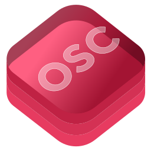

<p align="center">
    
</p>

# OSCKit
A Swift framework for sending, receiving, and parsing OSC messages &amp; bundles.

Largely inspired and adapted from [Figure 53's F53OSC Library](https://github.com/Figure53/F53OSC). 

Added features include:
 * takeBundle() - OSCPacketDestinations are notified when an OSC bundle is received so that embedded messages and bundles can be acted upon asynchronously using the bundles timetag.
 * Multicasting - Servers can join & leave multicast groups.
 * OSC 1.0 & 1.1 Stream Framing.

## Installation

#### Xcode 11+
[Add the package dependency](https://developer.apple.com/documentation/xcode/adding_package_dependencies_to_your_app) to your Xcode project using the following repository URL: 
``` 
https://github.com/SammySmallman/OSCKit
```
#### Swift Package Manager

Add the package dependency to your Package.swift and depend on "OSCKit" in the necessary targets:

```  swift
dependencies: [
    .package(url: "https://github.com/SammySmallman/OSCKit", from: "2.1.0")
]
```

#### App Sandbox Network Settings
- Enable Incoming Connections (Server)
- Enable Outgoing Connections (Client)

## Quick Start
### OSC Client
#### Step 1
Import OSCKit framework into your project
```swift
import OSCKit
```
#### Step 2
Create client
```swift
let client = OSCClient()
client.interface = "en0"
client.host = "10.101.100.101"
client.port = 24601
client.useTCP = true
client.delegate = self
```
#### Step 3
Conform to the Client Delegate Protocol's 

OSCClientDelegate:
```swift
func clientDidConnect(client: OSCClient) {
    print("Client did connect")
}

func clientDidDisconnect(client: OSCClient) {
    print("Client did disconnect")
}
```    

OSCPacketDestination:
```swift
func take(message: OSCMessage) {
    print("Received message - \(message.addressPattern)")
}

func take(bundle: OSCBundle) {
    print("Received bundle - time tag: \(bundle.timeTag.hex() elements: \(bundle.elements.count)")
}
```   
#### Step 4
Create a message
```swift
let message = OSCMessage(with: "/osc/kit", arguments: [1,
                                                    3.142,
                                                    "hello world!",
                                                    Data(count: 2),
                                                    OSCArgument.oscTrue,
                                                    OSCArgument.oscFalse,
                                                    OSCArgument.oscNil,
                                                    OSCArgument.oscImpulse])
```
#### Step 5
Send a message
```swift
client.send(packet: message)
```

## Authors

**Sammy Smallman** - *Initial Work* - [SammySmallman](https://github.com/sammysmallman)

See also the list of [contributors](https://github.com/SammyTheHand/OSCKit/graphs/contributors) who participated in this project.

## Acknowledgments

* Socket library dependency [CocoaSyncSocket](https://github.com/robbiehanson/CocoaAsyncSocket)
* Network Interface library dependency [Swift-Netutils](https://github.com/svdo/swift-netutils).
